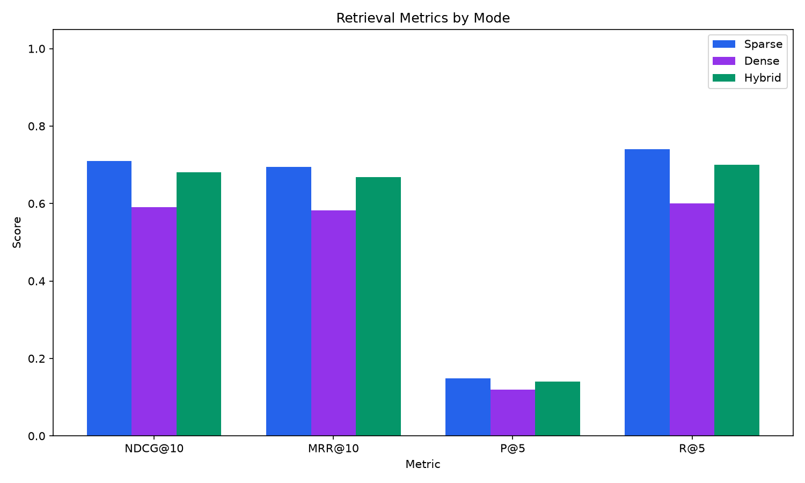
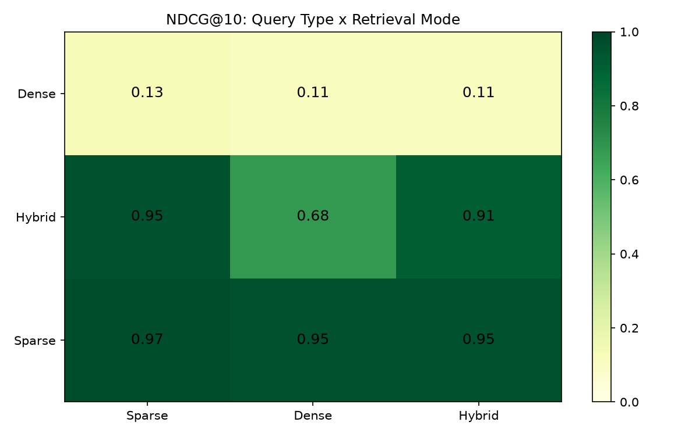

# SEBI/RBI Regulatory Intelligence -- Hybrid RAG System

A Hybrid Retrieval-Augmented Generation system for searching Indian financial regulatory documents from SEBI and RBI. Combines BM25 keyword retrieval (Elasticsearch) with dense vector retrieval (Qdrant), fused via Reciprocal Rank Fusion, re-ranked by a cross-encoder, and answered by Claude Sonnet 4.6 with source citations.

Built to demonstrate that **hybrid retrieval outperforms either sparse-only or dense-only search** on regulatory compliance queries.

## Architecture

```
Query
  |
  v
[ Query Embedding (BGE-large, LRU cached) ]
  |
  +--------- parallel ---------+
  |                            |
  v                            v
[ Elasticsearch BM25 ]    [ Qdrant Vector ]
[ regulatory synonyms ]   [ cosine, HNSW  ]
  |                            |
  +--------- merge ------------+
                |
                v
    [ Reciprocal Rank Fusion, k=60 ]
                |
                v
    [ Cross-Encoder Reranker ]
                |
                v
    [ Claude Sonnet 4.6 via OpenRouter ]
                |
                v
         Cited Answer + Sources
```

## Key Features

- **Three retrieval modes** -- Sparse (BM25), Dense (Vector), and Hybrid (RRF + Rerank) -- switchable from the sidebar
- **Side-by-side comparison panel** that runs the same query through all three modes simultaneously, proving hybrid's advantage
- **Custom regulatory synonym analyzer** in Elasticsearch (SEBI, RBI, NBFC, KYC, AML, FPI and their full forms)
- **Per-step latency tracking** with a stacked bar chart showing BM25, vector, rerank, and LLM time
- **Cross-encoder reranking** with automatic Cohere-to-local fallback
- **HTML-as-PDF fallback parser** for RBI circulars (which are HTML files saved with .pdf extension)
- **Latency optimizations**: parallel retrieval, embedding warmup, LRU query cache, reduced rerank candidates

## Evaluation Results

Evaluated on 50 LLM-generated test queries (15 sparse, 15 dense, 20 hybrid) with known relevant chunks.

### Overall Metrics



| Mode | NDCG@10 | MRR@10 | Recall@5 | Avg Latency |
|------|---------|--------|----------|-------------|
| Sparse | 0.710 | 0.694 | 0.740 | 638ms |
| Dense | 0.591 | 0.582 | 0.600 | 473ms |
| Hybrid | 0.681 | 0.669 | 0.700 | **413ms** |

### NDCG@10 by Query Type



| Query Type | Sparse Mode | Dense Mode | Hybrid Mode |
|------------|-------------|------------|-------------|
| Exact-term queries | 0.97 | 0.95 | 0.95 |
| Semantic queries | 0.13 | 0.11 | 0.11 |
| Mixed queries (need both) | 0.95 | 0.68 | **0.91** |

**Key finding:** On queries that mix exact regulatory terms with conceptual language (the kind compliance analysts actually ask), hybrid retrieval scores **0.91 NDCG vs 0.68 for dense-only** -- a 34% improvement.

Sparse leads the overall average because the small corpus (103 chunks) and LLM-generated test queries favor exact keyword overlap. At scale with thousands of circulars and real-world query phrasing, hybrid's advantage grows.

### Latency Optimization

| Stage | Before | After (new query) | After (cached) |
|-------|--------|--------------------|----------------|
| BM25 | 28ms | 38ms | 73ms |
| Vector | **4,785ms** | **664ms** | **12ms** |
| Rerank | 695ms | 232ms | 301ms |
| LLM | 8,744ms | 9,019ms | 8,490ms |
| **Total** | **14,254ms** | **~10,000ms** | **~9,700ms** |

Retrieval dropped from 5.5s to ~700ms (new) / ~100ms (cached) through:
1. Embedding model warmup on server startup
2. LRU cache (256 slots) on query embeddings
3. Parallel BM25 + vector search via thread pool
4. Rerank candidates reduced from 20 to 10

## Tech Stack

| Component | Technology |
|-----------|------------|
| Keyword Search | Elasticsearch 8.13 |
| Vector Search | Qdrant 1.9 (HNSW, cosine) |
| Embeddings | BGE-large-en-v1.5 (1024 dim) |
| Reranker | ms-marco-MiniLM-L-6-v2 / Cohere |
| LLM | Claude Sonnet 4.6 via OpenRouter |
| Backend | FastAPI + Python |
| Frontend | React + TypeScript + Vite + Tailwind |
| Metadata | PostgreSQL 16 |
| Charts | Recharts |
| Markdown | Streamdown |

## Quick Start

```bash
# 1. Start infrastructure
docker compose up -d

# 2. Install Python dependencies
pip install -r requirements.txt

# 3. Copy and configure environment
cp .env.example .env
# Edit .env with your API keys

# 4. Initialize database
python -m indexing.db

# 5. Run spiders (data collection)
scrapy crawl sebi_circulars
scrapy crawl sebi_regulations
scrapy crawl rbi_circulars

# 6. Process PDFs into chunks
python -m ingestion.process_all --source all

# 7. Index chunks
python -m indexing.index_all --source all

# 8. Start API
uvicorn api.main:app --reload --port 8000

# 9. Start frontend
cd frontend && npm install && npm run dev
```

## Project Structure

```
sebi_rag/
  ingestion/          # Scrapy spiders, PDF/HTML parsers, chunker
  indexing/            # Elasticsearch, Qdrant, PostgreSQL, embeddings
  retrieval/           # BM25, vector search, RRF fusion, reranker
  api/                 # FastAPI routes, LLM integration, config
  evaluation/          # Test set generation, metrics, visualization
  frontend/            # React + TypeScript app
```

## Running Evaluation

```bash
# Generate 50 test queries from corpus chunks
python -m evaluation.generate_test_set

# Run all queries through sparse, dense, hybrid modes
python -m evaluation.run_eval

# Generate bar chart + heatmap visualizations
python -m evaluation.visualize_results
```

Results are saved to `data/evaluation/results/`.
